# System Architecture

## Overview

The Bedrock Knowledge Base Chatbot is a Flask-based web application that leverages AWS Bedrock, OpenSearch Serverless, and S3 to provide an intelligent question-answering system with document management capabilities.

---

## High-Level Architecture

```mermaid
graph TB
    subgraph "Client Layer"
        Users[👤 End Users]
        Admins[👨‍💼 Administrators]
    end

    subgraph "Application Layer"
        EC2[🖥️ EC2 Instance<br/>Ubuntu 22.04<br/>Flask Application]
        Flask[🐍 Flask App<br/>Chatbot + Admin UI]
        DB[(💾 SQLite<br/>History & Metrics)]
    end

    subgraph "AWS AI Services"
        BedrockKB[🤖 Bedrock Knowledge Base<br/>OpenAI GPT OSS 120B]
        BedrockModel[🧠 Bedrock Model<br/>openai.gpt-oss-120b-1:0<br/>or Claude Sonnet 3.5]
    end

    subgraph "AWS Storage"
        S3[📦 S3 Bucket<br/>Documents]
        OpenSearch[🔍 OpenSearch Serverless<br/>Vector Store]
    end

    subgraph "AWS Infrastructure"
        VPC[🌐 VPC<br/>10.0.0.0/16]
        IAM[🔐 IAM Roles & Policies]
    end

    Users -->|HTTP/HTTPS| EC2
    Admins -->|HTTP/HTTPS| EC2
    EC2 --> Flask
    Flask --> DB
    Flask -->|Query| BedrockKB
    BedrockKB --> BedrockModel
    BedrockKB -->|Read| S3
    BedrockKB -->|Search| OpenSearch
    EC2 -->|Upload| S3
    EC2 -.->|Assumes| IAM
    BedrockKB -.->|Assumes| IAM

    style EC2 fill:#4A90E2,stroke:#2E5C8A,color:#fff
    style BedrockKB fill:#FF6B6B,stroke:#C92A2A,color:#fff
    style OpenSearch fill:#51CF66,stroke:#2F9E44,color:#fff
    style S3 fill:#FFD43B,stroke:#F59F00,color:#000
```



---

## Code Organization

The application follows a modular package-based architecture:

```
src/
├── app.py                 # Application entry point
├── api/                   # REST API routes (Flask Blueprints)
│   ├── chatbot.py        # Chatbot endpoints (/api/ask)
│   ├── history.py        # Search history endpoints (/api/history, /api/sources)
│   ├── admin.py          # Admin endpoints (/api/admin/*)
│   ├── metrics.py        # Analytics endpoints (/api/metrics)
│   └── health.py         # Health check endpoints (/api/health)
├── db/                    # Database layer
│   └── database.py       # SQLite operations
├── kb/                    # Knowledge Base integration
│   └── bedrock.py        # AWS Bedrock client
├── config/                # Configuration management
│   ├── manager.py        # Config manager
│   └── logging_config.py # Logging configuration
├── prompt/                # Prompt engineering
│   └── engine.py         # Advanced prompt logic
├── static/                # Frontend assets
│   ├── css/              # Stylesheets
│   └── js/               # JavaScript
├── templates/             # HTML templates
└── logging.ini            # Logging configuration (INI format)
```

### Key Features

- **Modular Design**: Each component is in its own package
- **Flask Blueprints**: API routes organized by functionality
- **Centralized Logging**: Configurable via INI file or environment variables
- **Separation of Concerns**: Business logic separated from API routes

---

## Detailed Component Architecture

### 1. Network Layer

```
Internet
   │
   ├─ Internet Gateway
   │
   └─ VPC (10.0.0.0/16)
      │
      ├─ Public Subnet (10.0.1.0/24)
      │  └─ EC2 Instance (Public IP)
      │
      └─ Private Subnet (10.0.2.0/24)
         └─ Reserved for future services
```

### 2. Application Layer

```
┌─────────────────────────────────────┐
│         Flask Application           │
├─────────────────────────────────────┤
│  • Chatbot UI (HTML/CSS/JS)        │
│  • Admin Dashboard (HTML/CSS/JS)   │
│  • REST API (Flask Blueprints)     │
│    - /api/ask (Chatbot)            │
│    - /api/history (Search History) │
│    - /api/sources (Documents)      │
│    - /api/admin/* (Admin)          │
│    - /api/metrics (Analytics)      │
│    - /api/health (Health Check)    │
│  • Modular Packages:               │
│    - api/ (REST API routes)        │
│    - db/ (Database layer)          │
│    - kb/ (Bedrock integration)      │
│    - config/ (Configuration)       │
│    - prompt/ (Prompt engine)       │
│  • Logging (INI configurable)      │
└─────────────────────────────────────┘
```

### 3. Data Flow

```
Document Upload Flow:
Admin → Flask API (/api/admin/upload) → S3 → Bedrock KB → OpenSearch (Indexing)

Query Flow:
User → Flask API (/api/ask) → Bedrock KB → OpenSearch (Vector Search) → 
Bedrock Model (OpenAI GPT OSS 120B - Generate Answer) → Flask → Database (Save History) → User

Search History Flow:
User → Flask API (/api/history) → Database → User (All Questions)

Documents List Flow:
User → Flask API (/api/sources) → Bedrock KB (list_documents) → S3 → User (Document Names & Sizes)
```

---

## REST API Endpoints

The application exposes the following REST API endpoints:

### Chatbot Endpoints
- `POST /api/ask` - Submit a question to the knowledge base
  - Request: `{ question, session_id?, conversation_history?, use_advanced_prompts? }`
  - Response: `{ answer, sources, session_id, query_id, response_time_ms, query_type }`
  - Uses OpenAI GPT OSS 120B (or Claude Sonnet 3.5) for answer generation

### History Endpoints
- `GET /api/history` - Get search history
  - Query params: `session_id?`, `limit?` (default: 50, max: 1000)
  - Response: `{ history: [...], count: N }`
  - Returns all questions if `session_id` is not provided

- `GET /api/history/<query_id>` - Get details of a specific query
  - Response: Query details with question, answer, sources, timestamp

- `GET /api/sources` - Get list of documents in knowledge base
  - Response: `{ documents: [{ name, size }], count: N }`
  - Returns document names and file sizes from S3 bucket

### Admin Endpoints
- `POST /api/admin/login` - Admin authentication (password-based)
- `POST /api/admin/logout` - Admin logout
- `GET /api/admin/dashboard` - Admin dashboard page
- `GET /api/admin/kb/status` - Get knowledge base status
- `POST /api/admin/upload` - Upload document to S3
- `POST /api/admin/kb/sync` - Trigger knowledge base sync
- `GET /api/admin/config` - Get current configuration

### Metrics Endpoints
- `GET /api/metrics` - Get analytics metrics
  - Query params: `start_date?`, `end_date?`
  - Response: Query statistics, performance metrics, top questions

### Health Endpoints
- `GET /api/health` - Health check endpoint
  - Response: `{ status, kb_status, db_status, timestamp }`

---

## Technology Stack

| Layer | Technology | Version |
|-------|-----------|---------|
| **OS** | Ubuntu | 22.04 LTS |
| **Runtime** | Python | 3.14 |
| **Framework** | Flask | 3.0.0 |
| **Application Port** | HTTP | 8080 |
| **Database** | SQLite | Built-in |
| **AI Model** | OpenAI GPT OSS 120B | openai.gpt-oss-120b-1:0 (or Claude Sonnet 3.5) |
| **Vector Store** | OpenSearch Serverless | Latest |
| **Object Store** | S3 | Latest |
| **Infrastructure** | Terraform | >= 1.0 |
| **Container** | Docker | Latest |
| **Logging** | Python logging | Configurable (INI) |

---

## Security Architecture

### IAM Roles

1. **Bedrock Knowledge Base Role**
   - Assumed by: `bedrock.amazonaws.com`
   - Permissions: S3 read, OpenSearch access

2. **OpenSearch Serverless Role**
   - Assumed by: `aoss.amazonaws.com`
   - Permissions: Collection management

3. **EC2 Instance Role**
   - Assumed by: `ec2.amazonaws.com`
   - Permissions: Bedrock invoke, S3 read/write, OpenSearch access

### Network Security

- VPC isolation (10.0.0.0/16)
- Security groups (ports 22, 80, 443, 8080)
- Public subnet (10.0.1.0/24) for EC2
- Private subnet (10.0.2.0/24) reserved for future services
- Encrypted EBS volumes
- Encrypted S3 buckets
- Admin authentication with session management
- IAM roles for service-to-service authentication

---

## Scalability Considerations

### Current Setup
- Single EC2 instance
- SQLite database (file-based)
- Stateless Flask application

### Future Scaling Options
- **Horizontal**: Add more EC2 instances behind ALB
- **Database**: Migrate to RDS (PostgreSQL/MySQL)
- **Caching**: Add ElastiCache (Redis)
- **CDN**: CloudFront for static assets
- **Auto Scaling**: EC2 Auto Scaling Groups

---

## Monitoring & Observability

### Current Metrics
- Query count
- Response times
- Success rates
- Top questions
- Daily query volume

### Logging
- Centralized logging configuration (INI file)
- Configurable log levels (DEBUG, INFO, WARNING, ERROR)
- File logging (rotating logs) or stdout-only mode
- Structured logging with timestamps, module names, and line numbers
- Separate error log file for critical issues

### Future Enhancements
- CloudWatch integration
- Performance dashboards
- Alerting

---

## Deployment Architecture

```
┌─────────────────┐
│  Terraform      │
│  Infrastructure │
└────────┬────────┘
         │
         ▼
┌─────────────────┐
│  AWS Resources  │
│  VPC, S3, IAM   │
│  Bedrock, OSS   │
└────────┬────────┘
         │
         ▼
┌─────────────────┐
│  EC2 Instance   │
│  Ubuntu 22.04   │
└────────┬────────┘
         │
         ▼
┌─────────────────┐
│  Deployment     │
│  1. copy-to-ec2 │
│  2. deploy-on-  │
│     ec2.sh      │
└────────┬────────┘
         │
         ▼
┌─────────────────┐
│  Services       │
│  • Systemd      │
│  • NGINX        │
│  • Flask/       │
│    Gunicorn     │
└─────────────────┘
```

### Deployment Process

The deployment follows a two-step process:

1. **Local to EC2**: Run `copy-to-ec2.sh` to copy application files to EC2
   - Copies `src/`, `config/`, `deployment/` directories
   - Uses SSH to transfer files to `/tmp/bedrock-chatbot-deploy/`

2. **On EC2**: Run `deploy-on-ec2.sh` to install and configure
   - Installs system dependencies
   - Creates Python virtual environment
   - Sets up environment variables
   - Configures systemd service
   - Sets up NGINX reverse proxy
   - Starts the application

### Application Logs

- **Flask logs**: `sudo journalctl -u bedrock-chatbot -f`
- **NGINX access logs**: `/var/log/nginx/bedrock-chatbot-access.log`
- **NGINX error logs**: `/var/log/nginx/bedrock-chatbot-error.log`

---

For interactive diagrams, see [ARCHITECTURE_DIAGRAM.md](ARCHITECTURE_DIAGRAM.md)


