# System Architecture Diagram

## Interactive Architecture Overview

This document provides an interactive diagram of the Bedrock Knowledge Base Chatbot system architecture.

---

## Complete System Architecture

```mermaid
graph TB
    subgraph "Internet"
        User[👤 Users]
        Admin[👤 Admin Users]
    end

    subgraph "AWS VPC"
        subgraph "Public Subnet"
            EC2[🖥️ EC2 Instance<br/>Ubuntu 22.04<br/>Flask Application<br/>Port 8080<br/>10GB Disk]
            IGW[🌐 Internet Gateway]
        end
        
        subgraph "Private Subnet"
            PrivateSubnet[Private Subnet<br/>Reserved for future use]
        end
    end

    subgraph "AWS Services"
        subgraph "Storage & Search"
            S3[📦 S3 Bucket<br/>abt-knowledge-base<br/>Documents Storage]
            OpenSearch[🔍 OpenSearch Serverless<br/>Vector Search Collection<br/>bedrock-index]
        end
        
        subgraph "AI Services"
            BedrockKB[🤖 Bedrock Knowledge Base<br/>Vector Knowledge Base<br/>OpenAI GPT OSS 120B]
            BedrockModel[🧠 Bedrock Model<br/>openai.gpt-oss-120b-1:0<br/>or anthropic.claude-3-5-sonnet-20241022-v2:0]
        end
        
        subgraph "IAM"
            BedrockRole[🔐 Bedrock KB Role<br/>S3 + OpenSearch Access]
            OpenSearchRole[🔐 OpenSearch Role<br/>Collection Access]
            EC2Role[🔐 EC2 Role<br/>Bedrock + S3 + OpenSearch]
            AppUser[👤 Application User]
            AppGroup[👥 Application Group<br/>Marketplace Permissions]
        end
    end

    subgraph "Application Components"
        Flask[🐍 Flask Application<br/>Modular Packages<br/>Port 8080]
        APIRoutes[🌐 API Routes<br/>Blueprints<br/>/api/ask, /api/history<br/>/api/sources, /api/admin]
        Database[(💾 SQLite Database<br/>History + Metrics)]
        PromptEngine[📝 Prompt Engine<br/>Advanced Prompts]
        Logging[📋 Logging System<br/>INI Configurable]
    end

    %% User interactions
    User -->|HTTP/HTTPS| EC2
    Admin -->|HTTP/HTTPS| EC2
    EC2 -->|Uses| Flask
    Flask -->|Routes| APIRoutes
    APIRoutes -->|Queries| BedrockKB
    APIRoutes -->|Stores| Database
    APIRoutes -->|Uses| PromptEngine
    Flask -->|Uses| Logging

    %% EC2 connections
    EC2 -->|Assumes| EC2Role
    EC2 -->|Uploads Documents| S3
    EC2 -->|Queries| BedrockKB

    %% Bedrock Knowledge Base flow
    BedrockKB -->|Uses| BedrockModel
    BedrockKB -->|Reads Documents| S3
    BedrockKB -->|Stores Vectors| OpenSearch
    BedrockKB -->|Assumes| BedrockRole

    %% IAM role relationships
    BedrockRole -->|Access| S3
    BedrockRole -->|Access| OpenSearch
    OpenSearchRole -->|Manages| OpenSearch
    EC2Role -->|Access| BedrockKB
    EC2Role -->|Access| S3
    EC2Role -->|Access| OpenSearch

    %% User and group
    AppUser -->|Member of| AppGroup

    %% Network flow
    IGW -->|Routes| EC2
    User -->|Via| IGW
    Admin -->|Via| IGW

    %% Data flow
    S3 -.->|Auto Sync| BedrockKB
    BedrockKB -.->|Ingestion| OpenSearch

    style EC2 fill:#4A90E2,stroke:#2E5C8A,color:#fff
    style BedrockKB fill:#FF6B6B,stroke:#C92A2A,color:#fff
    style OpenSearch fill:#51CF66,stroke:#2F9E44,color:#fff
    style S3 fill:#FFD43B,stroke:#F59F00,color:#000
    style Flask fill:#845EF7,stroke:#5F3DC4,color:#fff
    style Database fill:#20C997,stroke:#087F5B,color:#fff
```

---

## Data Flow Diagram

---

## Component Interaction Diagram

```mermaid
graph LR
    subgraph "Frontend"
        ChatUI[💬 Chatbot UI<br/>Search History<br/>Context Transparency]
        AdminUI[⚙️ Admin Dashboard<br/>Document Upload<br/>Metrics Dashboard]
    end

    subgraph "Backend"
        FlaskAPI[🌐 Flask API<br/>REST Endpoints]
        BedrockUtils[🔧 Bedrock Utils<br/>KB Queries]
        PromptEngine[📝 Prompt Engine<br/>Advanced Logic]
        Database[(💾 Database<br/>SQLite)]
    end

    subgraph "AWS Services"
        Bedrock[🤖 Bedrock KB]
        S3[📦 S3]
        OpenSearch[🔍 OpenSearch]
    end

    ChatUI --> FlaskAPI
    AdminUI --> FlaskAPI
    FlaskAPI --> BedrockUtils
    FlaskAPI --> PromptEngine
    FlaskAPI --> Database
    BedrockUtils --> Bedrock
    Bedrock --> OpenSearch
    Bedrock --> S3
    AdminUI --> S3

    style ChatUI fill:#4A90E2,stroke:#2E5C8A,color:#fff
    style AdminUI fill:#FF6B6B,stroke:#C92A2A,color:#fff
    style FlaskAPI fill:#845EF7,stroke:#5F3DC4,color:#fff
    style Bedrock fill:#51CF66,stroke:#2F9E44,color:#fff
```

---

## Network Architecture

---

## IAM Permissions Flow

```mermaid
graph TB
    subgraph "IAM Roles"
        BedrockRole[🔐 Bedrock KB Role<br/>bedrock.amazonaws.com]
        OpenSearchRole[🔐 OpenSearch Role<br/>aoss.amazonaws.com]
        EC2Role[🔐 EC2 Role<br/>ec2.amazonaws.com]
    end

    subgraph "IAM Policies"
        BedrockS3Policy[📄 Bedrock → S3<br/>GetObject, ListBucket]
        BedrockOSPolicy[📄 Bedrock → OpenSearch<br/>APIAccessAll]
        EC2BedrockPolicy[📄 EC2 → Bedrock<br/>InvokeModel, RetrieveAndGenerate]
        EC2S3Policy[📄 EC2 → S3<br/>GetObject, PutObject, ListBucket]
        EC2OSPolicy[📄 EC2 → OpenSearch<br/>APIAccessAll]
    end

    subgraph "Resources"
        S3[📦 S3 Bucket]
        OpenSearch[🔍 OpenSearch]
        Bedrock[🤖 Bedrock]
    end

    BedrockRole --> BedrockS3Policy
    BedrockRole --> BedrockOSPolicy
    BedrockS3Policy --> S3
    BedrockOSPolicy --> OpenSearch
    BedrockRole --> Bedrock

    OpenSearchRole --> OpenSearch

    EC2Role --> EC2BedrockPolicy
    EC2Role --> EC2S3Policy
    EC2Role --> EC2OSPolicy
    EC2BedrockPolicy --> Bedrock
    EC2S3Policy --> S3
    EC2OSPolicy --> OpenSearch

    style BedrockRole fill:#FF6B6B,stroke:#C92A2A,color:#fff
    style EC2Role fill:#4A90E2,stroke:#2E5C8A,color:#fff
    style OpenSearchRole fill:#51CF66,stroke:#2F9E44,color:#fff
```

---

## Application Features Architecture

---

## Deployment Architecture

```mermaid
graph TB
    subgraph LocalDev["Local Development"]
        Docker[🐳 Docker Compose<br/>Local Testing]
        LocalEnv[📝 .env File<br/>Configuration]
    end

    subgraph TerraformInfra["Terraform Infrastructure"]
        Terraform[⚙️ Terraform<br/>IaC]
        Modules[📦 Modules<br/>Network S3 IAM<br/>OpenSearch Bedrock EC2]
    end

    subgraph AWSCloud["AWS Cloud"]
        Infrastructure[☁️ AWS Resources]
    end

    subgraph EC2Deploy["EC2 Deployment"]
        EC2[🖥️ EC2 Instance]
        CopyScript[📋 copy-to-ec2.sh<br/>Copy files to EC2]
        DeployScript[🚀 deploy-on-ec2.sh<br/>Install and configure]
        Systemd[⚙️ Systemd Service<br/>bedrock-chatbot.service]
        Nginx[🌐 NGINX<br/>Reverse Proxy]
        FlaskApp[🐍 Flask App<br/>Gunicorn Workers]
    end

    Terraform --> Modules
    Modules --> Infrastructure
    Docker --> LocalEnv
    Infrastructure --> EC2
    CopyScript --> EC2
    EC2 --> DeployScript
    DeployScript --> Systemd
    DeployScript --> Nginx
    Systemd --> FlaskApp
    Nginx --> FlaskApp

    style Terraform fill:#7C3AED,stroke:#5B21B6,color:#fff
    style EC2 fill:#4A90E2,stroke:#2E5C8A,color:#fff
    style Docker fill:#2496ED,stroke:#1E6FA8,color:#fff
    style DeployScript fill:#51CF66,stroke:#2F9E44,color:#fff
```

---

## How to View These Diagrams

### Option 1: GitHub/GitLab
- These Mermaid diagrams render automatically on GitHub/GitLab
- Just view the markdown file in the repository

### Option 2: VS Code
- Install the "Markdown Preview Mermaid Support" extension
- Open the markdown file and use the preview

### Option 3: Online Viewer
- Copy the mermaid code blocks
- Paste into [Mermaid Live Editor](https://mermaid.live/)
- Interactive editing and export options

### Option 4: Documentation Sites
- Many documentation platforms (GitBook, Docusaurus, etc.) support Mermaid
- Include this file in your documentation

---

## Architecture Components Summary

| Component | Technology | Purpose |
|-----------|-----------|---------|
| **Frontend** | HTML/CSS/JavaScript | Chatbot UI, Admin Dashboard |
| **Backend** | Flask (Python 3.14) | REST API, Business Logic, Modular Packages |
| **Application Port** | HTTP | 8080 |
| **API Structure** | Flask Blueprints | Modular routes: /api/ask, /api/history, /api/sources, /api/admin, /api/metrics, /api/health |
| **Database** | SQLite | Search History, Metrics |
| **Logging** | Python logging + INI | Centralized logging configuration, file/stdout modes |
| **AI Service** | AWS Bedrock | Knowledge Base, OpenAI GPT OSS 120B (or Claude Sonnet 3.5) |
| **Vector Store** | OpenSearch Serverless | Vector embeddings storage |
| **Document Store** | S3 | Original documents |
| **Compute** | EC2 (Ubuntu 22.04) | Application hosting |
| **Networking** | VPC, Subnets, IGW | Network isolation |
| **Security** | IAM Roles & Policies | Access control |
| **Infrastructure** | Terraform | Infrastructure as Code |

---

## Key Features

### 🔍 Search History
- Automatic storage of all queries
- Displays all questions (not filtered by session)
- Session-based tracking
- Clickable history items

### 📚 Searched Documents
- Lists all documents in knowledge base
- Shows document names and file sizes
- Displays total document count
- Knowledge base document view

### 🧠 Advanced Prompt Logic
- System prompts
- Query type detection
- Few-shot examples
- Conversation context

### 📊 Metrics Dashboard
- Query statistics
- Performance metrics
- Top questions analysis
- Time-based filtering

---

## Data Flow Summary

1. **User Query** → Flask API
2. **Flask** → Bedrock Knowledge Base
3. **Bedrock** → OpenSearch (vector search)
4. **OpenSearch** → Returns relevant chunks
5. **Bedrock** → Generates answer (OpenAI GPT OSS 120B or Claude Sonnet 3.5)
6. **Flask** → Stores in database (history + metrics)
7. **Flask** → Returns answer + sources to user

---

## Security Architecture

- **Network**: VPC with public/private subnets
- **IAM**: Least privilege roles for each service
- **Encryption**: S3 encryption, EBS encryption
- **Access**: Security groups, IAM policies
- **Admin**: Password-protected admin UI

---

For more details, see:
- [README.md](README.md) - Main documentation
- [ENHANCEMENTS.md](ENHANCEMENTS.md) - Feature details
- [TERRAFORM_COMMANDS.md](TERRAFORM_COMMANDS.md) - Terraform usage

